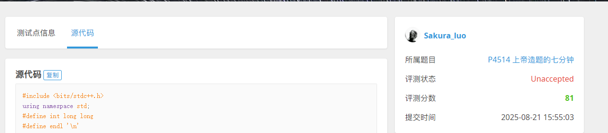
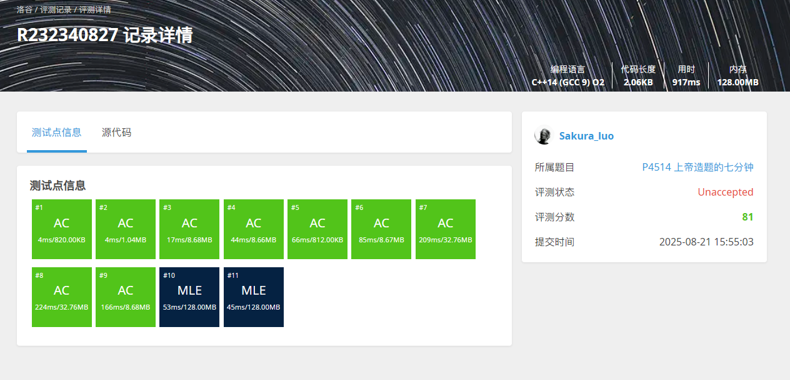

# P4514 上帝造题的七分钟

## Solution

#### 题意: 一个典型的二维树状数组模板题

下面是本题的几个小细节点 __o(=•ェ•=)m__：
1. 结果均不超过 __32__ 位带符号整数类型的表示范围。   
因此我们数组只要开 `int` 型就行了

2. 题目里面说了初始为0矩阵,也就是不需要初始值

3. 操作命令符 `op` 是字符类型

4. 因为操作命令符一直输出到文件末尾,所以可以使用 `while(cin >> op)` 来检查是否到达文件末尾

如果开大了比如 `long long`,则最后两个测试用例会报 __MLE{{{(>_<)}}}__

---

如图所示:  
_ps_: (图一为忘记关掉 `long long` 导致图二的 __MLE__)





## code
```cpp
#include<bits/stdc++.h>
using namespace std;
#define int long long
#define double long double
#define endl '\n'

int n, m;
const int MAXN = 2053;
int t1[MAXN][MAXN], t2[MAXN][MAXN], t3[MAXN][MAXN], t4[MAXN][MAXN];

int lowbit(int x)
{
    return x & -x;
}

void add(int x, int y, int v)
{
    for(int i = x; i <= n; i += lowbit(i))
    {
        for(int j = y; j <= m; j += lowbit(j))
        {
            t1[i][j] += v;
            t2[i][j] += v * x;
            t3[i][j] += v * y;
            t4[i][j] += v * x * y;
        }
    }
}

void add_(int x1, int y1, int x2, int y2, int v)
{
    add(x1, y1, v);
    add(x1, y2 + 1, -v);
    add(x2 + 1, y1, -v);
    add(x2 + 1, y2 + 1, v);
}

int getsum(int x, int y)
{
    int sum = 0;
    for (int i = x; i > 0; i -= lowbit(i))
    {
        for (int j = y; j > 0; j -= lowbit(j))
        {
            sum += (x + 1) * (y + 1) * t1[i][j] - (y + 1) * t2[i][j] - (x + 1) * t3[i][j] + t4[i][j];
        }
    }

    return sum;
}

int query(int x1, int y1, int x2, int y2)
{
    return getsum(x2, y2) - getsum(x2, y1 - 1) - getsum(x1 - 1, y2) + getsum(x1 - 1, y1 - 1);
}

void solve()
{
    char op;
    cin >> op >> n >> m;

    while(cin >> op)
    {
        if(op == 'L')
        {
            int a, b, c, d, k;
            cin >> a >> b >> c >> d >> k;

            add_(a, b, c, d, k);
        }
        else
        {
            int a, b, c, d;
            cin >> a >> b >> c >> d;

            cout << query(a, b, c, d) << endl;
        }
    }
    return ;
}

signed main()
{
    int T = 1;
    // cin >> T;
    while (T--) {
        solve();
    }
    return 0;
}
```

_ps_: 本篇题解是本蒟蒻第一篇题解也是第一次使用 `md` 文本,难免会有很多错落,恳请各位大佬不吝赐教 __orz__ ༼ つ ◕_◕ ༽つ

附一个卖萌的 _gif_:  

<p align="center">
    
</p>
